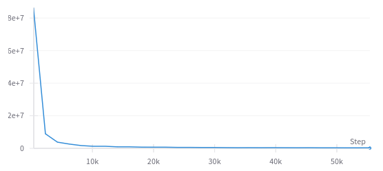

# Speeding up 3D Molecule Generation: Equivariant Diffusion with JAX and Consistency Models

### P. Bartak, L. Cadigan, M. Guo, M. Sedlacek, A. Vozikis

In this blog post, we present and discuss the seminal paper ["Equivariant Diffusion for Molecule Generation in 3D"](https://arxiv.org/abs/2203.17003) [1], 
which presented an Equivariant Diffusion Model (EDM). The authors trained a diffusion model with an 
Equivariant Graph Neural Network (EGNN) backbone to generate 3D molecules, a novel approach, which 
demonstrated strong improvement over other (non-diffusion based) generative methods at the time.
This inspired many subsequent works in the field [22, 23, 24, 25]. However, this method has a major 
downside: the sequential denoising process of diffusion models can take a large amount of time and compute, 
bottle-necking their performance [5].

<!---
Diffusion models are typically trained to generate data samples 
from pure noise using a sequential denoising procedure. 
--->

<!---
We hope to give the reader an easy-to-understand overview of the underlying theory and core ideas of the EDM paper, leading
to a better understanding of core topics in generative modelling and geometric deep learning.
--->

We present two extensions, aimed to increase the speed of the EDM and uncap its potential:

1. Training EDM as a Consistency Model [5]
2. Faster implementation of the EDM with JAX [17]

Consistency models enable the model to generate samples in a single step, which can be much faster than the sequential 
sampling in diffusion models. In conjunction with this, we can make the model even faster by implementing the model 
using the JAX framework. JAX has been shown to improve the speed of certain diffusion models by large amounts, with 
one study finding a 5x speed improvement in a comparable diffusion model [28]. JAX tends to improve the performance 
of models that require regular, repetitive computations such as diffusion models. 

<!---
Many previous works across various domains have shown that scaling model architectures to more parameter can significantly
improve performance [2, 3, 4]. This has been an apparent case with generative models for language [4, 20, 21],
but also for images and video [10, 11, 12, 13] among other use-cases. Many of these are variations of diffusion
models, and we believe that a similar improvement can be observed with training diffusion models based on
large Graph Neural Networks (GNN) as well [19]. With this work, we hope to take a step in this direction and demonstrate
that the EDM can be trained much faster, leaving room for working with (potentially very) large GNN backbones without
the need to scale or upgrade hardware extensively.
--->

This increase in efficiency serves several purposes. Most importantly, increased performance enables us to use larger
models with the same amount of compute. Many previous works across various domains have shown that scaling model
architectures to more parameters can significantly improve performance [2, 3, 4] in domains including language [4, 20, 21]
as well as images and video [10, 11, 12, 13]. Similar scaling effect was observed in Graph Neural Networks (GNN) [19].
We hope that, by improving the speed of our models, we can enable the use of larger GNN backbones without requiring
more expensive compute. Even without compute constraints, increasing speed hastens development and decreases
the carbon footprint overall.

We also note that these performance improvements are, in theory at least, not exclusive to EDM or GNNs. Many other ML 
models might be improved through a JAX reimplementation and many diffusion models can be trained as a consistency model.

## Groups and Equivariance for molecules

Equivariance is a property of certain functions, which ensures that the function's output transforms in a predictable manner under collections of transformations. This property is valuable in molecular modeling, where it can be used to ensure that the properties of molecular structures are consistent with their symmetries in the real world. specifically, we are interested in ensuring that some structure is preserved in the representation of the molecule when three types of transformations are applied to it: translation, rotation, and reflection. 

Formally, function $f$ is said to be equivariant to the action of a group $G$ if: 

$$T_g(f(x)) = f(S_g(x))$$ 

for all $g ∈ G$, where $S_g,T_g$ are linear representations related to the group element $g$ [32]. The three transformations we are interested in form the Euclidean group $E(3)$, for which $S_g$ and $T_g$ can be represented by a translation $t$ and an orthogonal matrix $R$ that rotates or reflects coordinates. $f$ is then equivariant to a rotation or reflection $R$ if: 

$$Rf(x) = f(Rx)$$

meaning transforming its input results in an equivalent transformation of its output. [1]

## E(n) Equivariant Graph Neural Networks (EGNNs)

<!---
Note: get better sense of what features are, confirm there are no edge attributes, attention mechansim
--->

<!---
The backbone of our diffusion model is the EGNN. <- stated in the intro, commenting out
An EGNN takes in a graph where some noise has been added and attempts to remove some / all of the noise. <- diffusion specific objective
--->

Generating molecules naturally leans itself into graph representation, with the nodes representing atoms within the
molecules, and edges representing their bonds. The features $\mathbf{h}_i \in \mathcal{R}^d$ of each atom, such as
element type, can then be encoded into the embedding of a node alongside it's position $\mathbf{x}_i \in \mathcal{R}^3$. The previously explained E(3) equivariance property can be used as an inductive prior that improves generalization, and EGNNs are a powerful tool which injects these priors about molecules into the model architecture itself, as the EDM paper had demonstrated [1]. Their usefulness is further supported
by EGNNs beating similar non-equivariant Graph Convolution Networks on molecular generation tasks [27].

The E(n) EGNN is a special type of message-passing Graph Neural Network (GNN) [31] with explicit rotation and translation equivariance baked in. A traditional message-passing GNN consists of several layers, each of which
updates the representation of each node, using the information in nearby nodes.

  

Figure 1: Visualization of a message passing network (Credit: Yuki Asano)

The EGNN specifically contains _equivariant_ convolution layers:

$$\mathbf{x}^{l+1},\mathbf{h}^{l+1}=EGCL\[ \mathbf{x}^l, \mathbf{h}^l \] \qquad \text{(1)}$$

The EGCL layer is defined through the formulas:

<!-- $`\mathbf{m}_{ij} = \phi_e(\mathbf{h}_i^l, \mathbf{h}_j^l, d^2_{ij})`$

$` \mathbf{h}_i^{l+1} = \phi_h\left(\mathbf{h}_i^l, \sum_{j \neq i} \tilde{e}_{ij} \mathbf{m}_{ij}\right) `$

$`\mathbf{x}_i^{l+1} = \mathbf{x}_i^l + \sum_{j \neq i} \frac{\mathbf{x}_i^l \mathbf{x}_j^l}{d_{ij} + 1} \phi_x(\mathbf{h}_i^l, \mathbf{h}_j^l, d^2_{ij})`$ -->

$`\mathbf{m}_{ij} = \phi_e(\mathbf{h}_i^l, \mathbf{h}_j^l, d^2_{ij})`$ $\qquad \text{(2)}$

$` \mathbf{h}_i^{l+1} = \phi_h\left(\mathbf{h}_i^l, \sum_{j \neq i} \tilde{e}_{ij} \mathbf{m}_{ij}\right) `$ $\qquad \text{(3)}$

$`\mathbf{x}_i^{l+1} = \mathbf{x}_i^l + \sum_{j \neq i} \frac{\mathbf{x}_i^l \mathbf{x}_j^l}{d_{ij} + 1} \phi_x(\mathbf{h}_i^l, \mathbf{h}_j^l, d^2_{ij})`$ $\qquad \text{(4)}$

where $h_l$ represents the feature $h$ at layer $l$, $x_l$ represents the coordinate at layer $l$ and 
$`d_{ij}= ||x_i^l-x^l_j||_2`$ is the Euclidean distance between nodes $`v_i`$ and $`v_j`$. A fully connected neural 
networks is used to learn the functions $`\phi_e`$, $`\phi_x`$, and $`\phi_h`$. At each layer, a message $`m_{ij}`$ 
is computed from the previous layer's feature representation. Using the previous feature and the sum of these messages, 
the model computes the next layer's feature representation.

This architecture then satisfies translation and rotation equivariance. Notably, the messages depend on the distance 
between the nodes and these distances are not changed by isometric transformations.

<!-- Using group actions we can explain translation equivariance in EGNN's. A translation by a vector c forms a group 
action G(x)= x+c. An EGNN is designed in a way so if the node positions are translated by c, resulting a new 
position x+c, the network with translate the output accordingly by c. This way it reflects the same group action 
ensuring the network respects the translation group action. One way this is achieved is by using relative positional 
information, which remain unchanged under the group action of translation. -->

## Diffusion Models

Diffusion models [18] are deeply rooted within the principles of physics, where the process describes particles moving 
from an area of higher concentration to an area of lower concentration - a process governed by random, stochastic 
interactions. In the physical world, this spreading can largely be traced back to the original configuration, which 
inspired scientists to create models of this behaviour. When applied to generative modelling, we usually aim to reconstruct data from some observed or sampled noise, which is an approach adopted by many powerful diffusion models. 

  
  

Figure 2: Physical diffusion (left) and generative modelling with diffusion (right) 

### Denoising Diffusion Probabilistic Models (DDPM)

One of the most widely-used and powerful diffusion models is the Denoising Diffusion Probabilistic Model (DDPM) [8]. In this model, the data is progressively noised and then the model learns to reverse this process, effectively "denoising" in order to generate new samples step-by-step starting from pure noise.

### Forward diffusion process ("noising")

<!---
To train a diffusion model, we take real data and progressively add noise to it. The image below provides an example with images:

[Diffusion image https://www.calibraint.com/blog/beginners-guide-to-diffusion-models]
--->

In DDPMs the forward noising process is parameterized by a Markov process, where transition at each time step $t$ adds
Gaussian noise with a variance of $\beta_t \in (0,1)$. We formally write this transition as:

$$
\begin{align}
q\left( x_t \mid x_{t-1} \right) := \mathcal{N}\left( x_t ; \sqrt{1-\beta_t} x_{t-1}, \beta_t \mathbf{I} \right) & \qquad \text{(5)}
\end{align}
$$

The whole Markov process leading to time step $T$ is given as a chain of these transitions:

$$
\begin{align}
q\left( x_1, \ldots, x_T \mid x_0 \right) := \prod_{t=1}^T q \left( x_t \mid x_{t-1} \right) & \qquad \text{(6)}
\end{align}
$$

Figure 3: The Markov process of forward and reverse diffusion [8]

### Reverse diffusion process ("denoising")

<!---
We then train a model to "denoise" the data. Specifically, we train the model to predict the previous timestep,
given the curren timestep. To be more specific, we train the model to predict the "noise" that had been added to the
original data to get the current timestep. By subtracting the noise, we get the original data.
--->

As Figure 3 shows, the reverse transitions are unknown, hence DDPM approximates them using a neural network 
parametrized by $\theta$:

$$p_\theta \left( x_{t-1} \mid x_t \right) := \mathcal{N} \left( x_{t-1} ; \mu_\theta \left( x_t, t \right), \Sigma_\theta \left( x_t, t \right) \right) \qquad \text{((7))}$$

Because we know the dynamics of the forward process, we know the variance at each $t$. Therefore, we can fix $\Sigma_\theta \left( x_t, t \right)$ to be $\beta_t \mathbf{I}$.

The network prediction is then only needed to obtain $\mu_\theta \left( x_t, t \right)$, given by:

$$\mu_\theta \left( x_t, t \right) = \frac{1}{\sqrt{\alpha_t}} \left( x_t - \frac{\beta\_t}{\sqrt{1 - \bar{\alpha}\_t}} \epsilon\_\theta \left( x_t, t \right) \right) \qquad \text{(8)}$$

where $\alpha_t = \Pi_{s=1}^t \left( 1 - \beta_s \right)$.

Hence, we can directly predict $x_{t-1}$ from $x_{t}$ using the network $\theta$ as:

$$
\begin{align}
x_{t-1} = \frac{1}{\sqrt{1 - \beta_t}} \left( x_t - \frac{\beta_t}{\sqrt{1 - \alpha_t}} \epsilon_\theta \left( x_t, t \right) \right) + \sqrt{\beta_t} v_t & \qquad \text{((9))}
\end{align}
$$

where $v_T \sim \mathcal{N}(0, \mathbf{I})$ is a sample from the pure Gaussian noise.

### Training diffusion models

The training objective of diffusion-based generative models amounts to **"maximizing the log-likelihood of the sample generated (at the end of the reverse process) which belongs to the original data distribution."**

To maximize the log-likelihood of a gaussian distribution, we need to try and find the parameters of the distribution (μ, σ²) such that it maximizes the _likelihood_ of the (generated) data belonging to the same data distribution as the original data.

To train our neural network, we define the loss function (L) as the objective function’s negative. So a high value for p_θ(x₀), means low loss and vice versa.

$$
p_{\theta}(x_{0}) := \int p_{\theta}(x_{0:T})dx_{1:T} \qquad \text{(10)}
$$

$$
L = -\log(p_{\theta}(x_{0})) \qquad \text{(11)}
$$

However, this is intractable because we need to integrate over a very high dimensional (pixel) space for continuous values over T timesteps. Instead, take inspiration from VAEs and find a new, tractable training objective using a variational lower bound (VLB), also known as _Evidence lower bound_ (ELBO). We have :

$`
\mathbb{E}[-\log p_{\theta}(x_{0})] \leq \mathbb{E}_{q} \left[ -\log \frac{p_{\theta}(x_{0:T})}{q(x_{1:T} | x_{0})} \right] = \mathbb{E}_{q} \left[ -\log p(X_{T}) - \sum_{t \geq 1} \log \frac{p_{\theta}(x_{t-1} | x_{t})}{q(x_{t} | x_{t-1})} \right] =: L \qquad \text{(12)}
`$

After some simplification, we arrive at this final $`L_{vlb}`$ - Variational Lower Bound loss term:

$`
\mathbb{E}_{q} \left[ D_{KL}(q(x_{T}|x_{0}) \parallel p(x_{T})) \bigg\rvert_{L_{T}} + \sum_{t > 1} D_{KL}(q(x_{t-1}|x_{t}, x_{0}) \parallel p_{\theta}(x_{t-1}|x_{t})) \bigg\rvert_{L_{t-1}} - \log p_{\theta}(x_{0}|x_{1}) \bigg\rvert_{L_{0}} \right] \qquad \text{(13)}
`$

We can break the above $`L_{vlb}`$ loss term into individual timesteps as follows:

$$
L_{vlb} := L_{0} + L_{1} + \cdots + L_{T-1} + L_{T} \qquad \text{(14)}
$$

$$
L_{0} := - \log p_{\theta}(x_{0}|x_{1}) \qquad \text{(15)}
$$

$$
L_{t-1} := D_{KL}(q(x_{t-1}|x_{t}, x_{0}) \parallel p_{\theta}(x_{t-1}|x_{t})) \qquad \text{(16)}
$$

$$
L_{T} := D_{KL}(q(x_{T}|x_{0}) \parallel p(x_{T})) \qquad \text{(17)}
$$

The terms ignored are:

1. **L₀** – Because the original authors got better results without this.
2. **Lₜ** – This is the _"KL divergence"_ between the distribution of the final latent in the forward process and the first latent in the reverse process. Because there are no neural network parameters we can't do anything with it so we just ignore from optimization.

So **Lₜ₋₁** is the only loss term left which is a KL divergence between the _“posterior”_ of the forward process, and the parameterized reverse diffusion process. Both terms are gaussian distributions as well.

$$
L_{vlb} := L_{t-1} := D_{KL}(q(x_{t-1}|x_{t}, x_{0}) \parallel p_{\theta}(x_{t-1}|x_{t})) \qquad \text{(18)}
$$

The term q(xₜ₋₁|xₜ, x₀) is referred to as _“forward process posterior distribution.”_

During training, our DL model learns to approximate the parameters of this posterior in order to minimize the KL divergence.

Figure 4: Stochastic sampling process (noisy images on top, predicted images on bottom)

## Equivariant Diffusion Models (EDM) for 3D molecule generation

We will specifically focus on an E(n) equivariant diffusion model presented by the EDM paper, 
which specialized in 3D molecular generation [1]. The authors used a DDPM-based diffusion model with an EGNN backbone 
for predicting both continuous (atom coordinates) and categorical features (atom types).

As we have hinted earlier in the EGNN section, molecules are naturally equivariant to E(3) rotations and translation 
while being easily represented with a graph. The categorical atomic properties are already invariant to E(3) 
transformations, hence they can be generated with a regular diffusion. For the generated atom positions however, 
we need to specifically ensure this equivariance to rotations and translations throughout the diffusion process.

### How to achieve equivariance during diffusion?

**Rotations**

Being equivariant to rotations, effectively meant that we want rotations applied at any given time step $t$ 
in the diffusion process to not have an effect on the likelihood of generating a corresponding rotated sample at the 
next time step $t+1$. In other words, if the best prediction is to move position of each atom $a_i$ in a certain 
diretion $\mathbf{v}_i$, after we rotate the whole molecule by some arbitrary rotation matrix $\mathbf{R}$, the 
equivariantly rotated predictions $\mathbf{R}\mathbf{v}_i$ should still be the best one to pick.

Formally, we say that for any orthogonal rotation matrix $\mathbf{R}$ the following must hold:

$$p(y|x) = p(\mathbf{R}y|\mathbf{R}x) \qquad \text{(19)}$$

<!---
(TBA - have a nice figure in my head to illustrate this with vectors if I can make it in time)
--->

To uphold this property throughout the diffusion process, the Markov chain transition probability distributions at every 
time step $t$ must be roto-invariant, otherwise rotations would alter the likelihood, breaking this desired equivariance property.

  
  

Figure 5: Examples of 2D roto-invariant distributions 

As the EDM authors point out, an invariant distribution composed with an equivariant invertible function results in an
invariant distribution [14]. They further point out that if $x \sim p(x)$ is invariant to a group, and the transition probabilities
of a Markov chain $y \sim p(y|x)$ are equivariant, then the marginal distribution of $y$ at any time step $t$ is also invariant
to that group [15].

In the case of EDM, the underlying EGNN ensures equivariance while the initial sampling distribution
can easily be constrained to something roto-invariant, such as a simple mean zero Gaussian with diagonal
covariance matrix seen in Figure 5 (left).

**Translations**

It has been shown, that it is impossible to have non-zero distributions invariant to translations [16].
Intuitively, the translation invariance property means that any point $\mathbf{x}$ results in the same assigned $p(\mathbf{x})$,
leading to a uniform distribution, which, if stretched over an unbounded space, would be approaching zero-valued probabilities
thus not integrating to one.

The EDM authors bypass this with a clever trick of always re-centering the generated samples to have center of gravity at
$\mathbf{0}$ and further show that these $\mathbf{0}$-centered distributions lie on a linear subspace that can reliably be used 
for equivariant diffusion [1, 15]. 

We hypothesize that, intuitively, moving a coordinate from e.g. 5 to 6 on any given axis is the same as moving from 
8 to 9. But EDM predicts the actual atom positions, not a relative change, hence the objective needs to adjusted. 
By constraining the model to this "subspace" of options where the center of the molecule is always at $\mathbf{0}$, 
the absolute positions are effectively turned into relative ones w.r.t. to the center of the molecule, hence the model 
can now learn relationships that do not depend on the absolute position of the whole molecule in 3D space.

<!---
(TBA - quadruple check this intuition is correct and makes sense !!!!)
--->

### Training the EDM

As described in the DDPM section and following other modern diffusion models, an EGNN is trained in the standard 
diffusion framework to predict the noise at each time step of the reverse process, which is then used to iteratively 
reconstruct samples on the data distribution by adding signal to pure noise sampled from the Gaussian at time $T$. 
With the caveat that the predicted noise must be calibrated to have center of gravity at $\mathbf{0}$ to ensure 
equivariance as we have described earlier. It is worth explicitly noting that the noise added during the forward 
diffusion process must also be equivariant, hence it is sampled from a $\mathbf{0}$-mean Gaussian distribution with 
a diagonal covariance matrix.

Using the KL divergence loss term introduced in DDPM with the EDM model parametrization simplifies the loss function to:

$\qquad \text{(20)}$

<!-- $`\mathcal{L}_t =$ $\mathbb{E}_{\epsilon_t}$ $\left[ \frac{1}{2} w(t) \| \epsilon_t - \hat{\epsilon}_t \|^2 \right]`$

and $`\epsilon_t \sim \mathcal{N}_{xh}(0, \mathbb{I})`$. -->

where $\( w(t) = \left(1 - \frac{\text{SNR}(t-1)}{\text{SNR}(t)}\right) \)$ and $\( \hat{\epsilon}_t = \phi(z_t, t) \)$.

However, the EDM authors found that the model had better empirical performance with a constant $w(t) = 1$, disregarding the
signal-to-noise ration (SNR). Thus, the loss term effectively simplifies to a MSE.

Since coordinates and categorical features are on different scales, the EDM authors also found they achieved better performance when scaling the inputs before prediction and then rescaling them back after.

### Consistency Models

Although diffusion Models have significantly advanced the fields of image, audio, and video generation, but they depend on an
iterative de-noising process to generate samples, which can be very slow [5]. To generate good samples, a lot of steps are often required (sometimes in the 1000s). This issue is exacerbated when dealing with high dimensional data where all operations are even more computationally expensive. As hinted in the introduction, we look at Consistency models in our work to bypass this bottleneck.

This is where Consistency Models really shine. This new family of models reduces the number of steps during de-noising up to just a single step generation, significantly speeding up this process, while allowing for a controlled trade-off between speed and sample quality.

### How does it work?

To understand consistency models, one must look at diffusion from a slightly different perspective than it's usually presented.
Consider the transfer of mass under the data probability distribution in time.

Figure 6: Illustration of a bimodal distribution evolving to a Gaussian over time

Such process are often well described with a differential equation. In the next sections we look closely at the work of Yang Song [5,6] and others to examine how they leverage the existence of such an Ordinary Differential Equation (ODE) to generate strong
samples much faster.

 

**Modelling the noising process as an SDE**

Song et al. [6] have shown that the noising process in diffusion can be described with a Stochastic Differential Equation (SDE)
transforming the data distribution $p_{\text{data}}(\mathbf{x})$:

$$d\mathbf{x}_t = \mathbf{\mu}(\mathbf{x}_t, t) dt + \sigma(t) d\mathbf{w}_t \qquad \text{(21)}$$

Where $t$ is the time-step, $\mathbf{\mu}$ is the drift coefficient, $\sigma$ is the diffusion coefficient,
and $\mathbf{w}_t$ is the stochastic component denoting standard Brownian motion. This stochastic component effectively
represents the iterative adding of noise to the data in the forward diffusion process and dictates the shape of the final
distribution at time $T$.

Typically, this SDE is designed such that $p_T(\mathbf{x})$ at the final time-step $T$ is close to a tractable Gaussian.

 

**Existence of the PF ODE**

This SDE has a remarkable property, that a special ODE exists, whose trajectories sampled at $t$ are distributed
according to $p_t(\mathbf{x})$ [5]:

$$d\mathbf{x}_t = \left[ \mathbf{\mu}(\mathbf{x}_t, t) - \frac{1}{2} \sigma(t)^2 \nabla \log p_t(\mathbf{x}_t) \right] dt \qquad \text{(22)}$$

This ODE is dubbed the Probability Flow (PF) ODE by Song et al. [5] and corresponds to the different view of diffusion
manipulating probability mass over time we hinted at in the beginning of the section.

A score model $s_\phi(\mathbf{x}, t)$ can be trained to approximate $\nabla log p_t(\mathbf{x})$ via score matching [5].
 <!-- and following Karras et al. [7] it is -->
Since we know the parametrization of the final distribution $p_T(\mathbf{x})$ to be a standard Gaussian parametrized with $\mathbf{\mu}=0$ and $\sigma(t) = \sqrt{2t}$, this score model can be plugged into the equation (22) and the expression reduces itself to an empirical estimate of the PF ODE:

$$\frac{dx_t}{dt} = -ts\phi(\mathbf{x}_t, t) \qquad \text{(23)}$$

With $\mathbf{\hat{x}}_T$ sampled from the specified Gaussian at time $T$, the PF ODE can be solved backwards in time to obtain
a solution trajectory mapping all points along the way to the initial data distribution at time $\epsilon$.

Figure 7: Solution trajectories of the PF ODE. [5]

 

**Solving the PF ODE**

In Figure 7 the "Noise" distribution corresponds to $p_T(\mathbf{x})$ and the "Data" distribution is treated as one at $t=\epsilon$
very close to time zero. For numerical stability we want to avoid explicitly having $t=0$ [7].

Following Karras et al. [7], the time horizon $[\epsilon, T]$ is discretized into $N-1$ sub-intervals with
boundaries $t_1 = \epsilon < t_2 < \cdots < t_N = T$. This improves performance and stability over treating time as a
continuous variable.

In practice, the following formula is most often used to determine these boundaries [7]:

$$t_i = \left(\epsilon^{1/\rho} + \frac{i - 1}{N - 1}(T^{1/\rho} - \epsilon^{1/\rho})\right)^\rho \qquad \text{(24)}$$

Given any of-the-shelf ODE solver (e.g. Euler) and a trained score model $s_\phi(\mathbf{x}, t)$, we can solve this PF ODE.

As shown before, the score model is needed to predict the change in signal over time $\frac{dx_t}{dt}$, i.e. a
generalization of what we referred to as "predicting noise to next time step" earlier.

A solution trajectory, denoted $\\{\mathbf{x}_t\\}$, is then given as a finite set of samples $\mathbf{x}_t$ for every
discretized time-step $t$ between $\epsilon$ and $T$.

 

**Consistency Function**

Given a solution trajectory $\\{\mathbf{x}_t\\}$, we define the _consistency function_ as:

$f:$ $(\mathbf{x}_t, t)$ $\to$ $\mathbf{x}_{\epsilon}$ 

In other words, a consistency function always outputs a corresponding datapoint at time $\epsilon$, i.e. very close to
the original data distribution for every pair ($\mathbf{x}_t$, t).

Importantly, this function has the property of _self-consistency_: i.e. its outputs are consistent for arbitrary pairs of
$(x_t, t)$ that lie on the same PF ODE trajectory. Hence, we have $f(x_t, t) = f(x_{t'}, t')$ for all $t, t' \in [\epsilon, T]$.

The goal of a _consistency model_, denoted by $f_\theta$, is to estimate this consistency function $f$ from data by
being enforced with this self-consistency property during training.

 

**Boundary Condition & Function Parametrization**

For any consistency function $f(\cdot, \cdot)$, we must have $f(x_\epsilon, \epsilon) = x_\epsilon$, i.e., $f(\cdot, 
\epsilon)$ being an identity function. This constraint is called the _boundary condition_ [5].

The boundary condition has to be met by all consistency models, as we have hinted before that much of the training relies
on the assumption that $p_\epsilon$ is borderline identical to $p_0$. However, it is also a big architectural
constraint on consistency models.

For consistency models based on deep neural networks, there are two ways to implement this boundary condition almost
for free [5]. Suppose we have a free-form deep neural network $F_\theta (x, t)$ whose output has the same dimensionality
as $x$.

1.) One way is to simply parameterize the consistency model as:

$$
f_\theta (x, t) =
\begin{cases}
x & t = \epsilon \\
F_\theta (x, t) & t \in (\epsilon, T]
\end{cases} \\
\qquad \text{(25)}
$$

2.) Another method is to parameterize the consistency model using skip connections, that is:

$$
f_\theta (x, t) = c_{\text{skip}} (t) x + c_{\text{out}} (t) F_\theta (x, t) \qquad \text{(26)}
$$

where $c_{\text{skip}} (t)$ and $c_{\text{out}} (t)$ are differentiable functions such that $c_{\text{skip}} (\epsilon) = 1$,
and $c_{\text{out}} (\epsilon) = 0$.

This way, the consistency model is differentiable at $t = \epsilon$ if $F_\theta (x, t)$, $c_{\text{skip}} (t)$, $c_{\text{out}} (t)$
are all differentiable, which is critical for training continuous-time consistency models.

In our work, we utilize the latter methodology in order to satisfy the boundary condition.

 

**Sampling**

With a fully trained consistency model $f_\theta(\cdot, \cdot)$, we can generate new samples by simply sampling from the initial
Gaussian $\hat{x_T}$ $\sim \mathcal{N}(0, T^2I)$ and propagating this through the consistency model to obtain
samples on the data distribution $\hat{x_{\epsilon}}$ $= f_\theta(\hat{x_T}, T)$ with as little as one diffusion step.

<!-- Importantly, one can also use the consistency model to generate samples using multiple time steps by alternating denoising
and noise injection steps for improved sample quality at the cost of speed. It should also be noted that this has
important applications in zero-shot data editing [5], but in the case of molecules we did not use this property. -->

Figure 8: Visualization of PF ODE trajectories for molecule generation in 3D. [9]

### Training Consistency Models

Consistency models can either be trained by "distillation" from a pre-trained diffusion model, or in "isolation" as
a standalone generative model from scratch. In the context of our work, we focus only on the latter and
have no dependency on an already pre-trained model. In our case scenario we decided to train in isolation, building a consistency model from scratch. We decided to follow this approach due to the lack of an already pre-trained score function diffusion model.
In order to train in isolation we ned to leverage the following unbiased estimator:

$$ \nabla \log p_t(x_t) = - \mathbb{E} \left[ \frac{x_t - x}{t^2} \middle| x_t \right] \qquad \text{(27)}$$

where $x \sim p_\text{data}$ and $x_t \sim \mathcal{N}(x; t^2 I)$.

That is, given $x$ and $x_t$, we can estimate $\nabla \log p_t(x_t)$ with $-(x_t - x) / t^2$.
This unbiased estimate suffices to replace the pre-trained diffusion model in consistency distillation
when using the Euler ODE solver in the limit of $N \to \infty$ [5].

<!---
**Theorem 2.** Let $`\Delta t := max_{n \in [1, N-1]} |t_{n+1} - t_n|`$. Assume $d$ and $f_{\theta^-}$ are both
twice continuously differentiable with bounded second derivatives, the weighting function $`\lambda(\cdot)`$ is
bounded, and $`\mathbb{E} [\| \nabla \log p_{t_n}(x_{t_n}) \|_2^2] < \infty`$.

Assume further that we use the Euler ODE solver, and the pre-trained score model matches the ground truth, i.e.,
$`\forall t \in [\epsilon, T] : s_\phi(x, t) \equiv \nabla \log p_t(x)`$.
Then, $`\mathcal{L}_{CD}^N (\theta, \theta^-; \phi) = \mathcal{L}_{CT}^N (\theta, \theta^-) + o(\Delta t)`$,
where the expectation is taken with respect to $`\mathbf{x} \sim p_\text{data}`$, $`n \sim \mathcal{U}[[ 1, N-1 ]]`$,
and $`x_{t_{n+1}} \sim \mathcal{N}(x; t_n^2 I)`$.
--->

Song et al. [5] justify this with a further theorem in their paper and show that the consistency training objective (CT loss)
can then be defined as:

$\mathcal{L}_{CT}^N (\theta, \theta^-)$ = $\mathbb{E}[\lambda(t_n)d(f_\theta(x + t_{n+1} \mathbf{z}, t_{n+1}), f_{\theta^-}(x + t_n \mathbf{z}, t_n))]$ $\qquad \text{(28)}$

where $\mathbf{z} \sim \mathcal{N}(0, I)$.

Crucially, $\mathcal{L}(\theta, \theta^-)$ only depends on the online network $f_\theta$, and the target network
$f_{\theta^-}$, while being completely agnostic to diffusion model parameters $\phi$.

<!---
### Visualization

Figure #(?): Consistency model example for the MNIST dataset.

(TBA - visualizations of the molecules if possible)

*Figure #: Consistency model working for the MNIST dataset.*

We conducted the expirement of the consistency model working for the MNIST dataset. During training we sampled after
10 epochs and visualized the results. In figure # we can see the MNIST digits in different epochs. What's really
noteworthy is that those samples were generated in one step and not by doing the denoising process what takes a
very long time and a high number of steps, usually 1000-4000, which saves a lot of time and computation power
during sampling.

(TBA - maybe put back some talking about the images idk yet [Martin])
-->

## JAX

<!-- [Note: need to figure out the terminology here]
[Sources: https://jax.readthedocs.io/en/latest/jit-compilation.html#jit-compilation]
[https://eitca.org/artificial-intelligence/eitc-ai-gcml-google-cloud-machine-learning/google-cloud-ai-platform/introduction-to-jax/examination-review-introduction-to-jax/how-does-jax-leverage-xla-to-achieve-accelerated-performance/#:~:text=JAX%20(Just%20Another%20XLA)%20is,performance%20in%20machine%20learning%20applications.] -->

<!-- https://jax.readthedocs.io/en/latest/faq.html#benchmarking-jax-code -->

<!-- One paper found reimplementing Diffusion-QL (a diffusion-based offline RL algorithm) lead to a 5x speed increase (https://proceedings.neurips.cc/paper_files/paper/2023/file/d45e0bfb5a39477d56b55c0824200008-Paper-Conference.pdf).  -->

Jax is a machine learning framework that can result in significantly faster code depending on the task. During compilation, Jax transforms are turned into computation graphs. XLA turns these computation graphs into efficient, GPU-ready machine code. This process becomes even quicker when we use JIT (Just in Time) compilation. With Jit compilation, arrays are replaced with abstract tracers, which encode the shape and datatype (but not values) of the arrays. Using these tracers, jax.jit extracts the sequence of operations required by the function. This sequence can then be cached and reapplied within XLA on new inputs of the same shape and data type, saving computation.

Diffusion seems like an ideal use case for Jax, since diffusion requires certain functions to be run repeatedly. Thus, we can optimize the function once and gain speed everytime we reuse the function. However, in order to run Jax with jit, we had to overcome several changes:

### Using pure functions:

Jax functions must be pure, meaning the function will always have the same result given the same input. Thus, we had to restructure functions so that they did not rely on global variables. This also means JAX cannot use stateful randomness like Pytorch. Instead, randomness is controlled by explicit random keys. We maintain a primary random key ("root key") and generate new subkeys from it as needed. This approach ensures consistent randomization while also allowing for reproducibility of results. Additionally, pure functions cannot have side effects. Thus, we had to remove certain statements, like assert and print statements.

### Enabling Jit:

In the pytorch implementations, the size of many inputs would vary based upon the batch. For example, h (the node features) had a shape of [size_batch, size_largest_molecule_in_batch]. Depedending on the batch, the number of columns in h ranged from 26 to 29. This would cause massive performance problems for a jitted function, because JAX must create a new computation graph to accomodate the newly sized inputs. To prevent this, we needed to apply padding to all inputs to standardize the input size.

Jit also adds some complexity and constraints to using control flow. Jit must understand the path the control flow will take, which may be tough given the potentially abstract inputs. We had to change certain conditionals to work with jax.

### Dataset Processing:

To enhance the efficiency of data transformation, we converted PyTorch tensors into JAX numpy arrays within the dataloader. This adjustment speeds up the data loading process, facilitating smoother integration with JAX's computational methods.

### Neural Network Architecture:

The neural network was restructured to conform to JAX's architectural requirements. Key functional components within the network class now include the setup method and the **call** method. The setup method is used for initializing network parameters, while the **call** method handles forward propagation and integrates with JAX’s automatic differentiation to manage gradient computations and backpropagation. Additionally, the model includes many custom-defined functions that can be accessed through options within the **call** method. Notably, the model incorporates randomized operations in the diffusion model, which are crucial for ensuring diversity in the generated data.

### Model Initialization and Training:

Before commencing the training process, the model is first initialized with the initial batch of data from the dataset. This step ensures that the model's layers are constructed with dimensions that match the input size, which remains flexible and undefined to simplify model architecture. During training, the **call** method, model parameters, and the optimizer are encapsulated into a single 'state' object.

To accelerate the training process, the training steps per epoch are compiled using JAX's jit compiler, which optimizes execution speed by compiling Python functions into machine code. The original PyTorch implementation already paralleled batch processing inside the model, so we preserved this feature in the JAX implementation instead of using JAX’s vmap for vectorizing operations across batches.

## Experiments

### Dataset & Metrics

The QM9 dataset[29, 30] (Quantum Machine 9) is a commonly used dataset containing the molecular properties and atomic 
coordinates for 133,885 small molecules, along with computed geometric, energetic, electronic, and thermodynamic 
properties. Each molecule contains up to 9 heavy atoms (with up to 29 atoms in total, including hydrogen). In this 
experiment, we train the EDM model to generate molecules with 3D coordinates and atom types (H, C, N, O, F). Other, 
related datasets include QM7, QM7b, QM8, ZINC, ChEMBL, MOSES, and Tox21.

Replicating the original EDM paper, we use the train/validation/test splits, which divide the data into 100,000 training 
samples, 18,000 validation samples, and 13,000 test samples. To evaluate the quality of our molecule generation, we 
evaluate atom stability (the percentage of atoms with the correct valency) and molecule stability (the percentage 
of generated molecules where all atoms are stable) of the generated molecules. For a full list of hyperparameters, please consult the README in our repository. 

### EDM Consistency Model Results

We were able to successfully train EDM as a consistency model in isolation. We achieved nearly identical training
loss curves, both in magnitude of the NLL and convergence rate: 

  
  

Figure nTBA: Training loss curves for original EDM (left), and consistency model EDM (right)

For validation and testing, we compared samples from an EMA model against the corresponding ground truth sample,
since consistency models are trained to produce samples directly on the data distribution. 
We achieved similar convergence rates for both val and test losses but with a different magnitude due to the 
changed objective:

  
  

  
  

Figure nTBA: Val (top) and Test (bottom) loss curves for original EDM (left), and consistency model EDM (right)

These results were obtained using the same EGNN back-bone, batch-size, 
learning rate, and other relevant hyperparameters, only differing in the number of epochs completed.
However, given the displayed loss curves, we have little reason to believe that training the consistency model
for longer would be beneficial.

Using single-step sampling with consistency models, we were only able to reliably achieve around 15% atom stability in
the best case scenario with a large batch size. We were not successful in generating any stable molecules using
the consistency model.

  

Figure nTBA: Best results for atom stability metric using single-step sampling with consistency models trained on
batch_size = 1024 for improved stability.

The controlled trade-off between speed and sample quality should be possible with multi-step sampling,
however, all attempts to make multi-step sampling work resulted in decreased atom stability. We firther 
discuss the set-up and hypothesise why this did not work in the next section (TBA). 

### EDM in JAX Results

Due to time constraints, we were unable to tune either of our models to the level of the previous pytorch implementation. After training, the consistency model achieved an atom stability of 15% while the Jax model achieved an atom stability of 16%. Neither of these are competitive with the 99% atom stability reported in the original paper. 

We strongly suspect that the inferior performance of the Jax model results from a bug in our code, which we are still attempting to identify. The bug may be Jax specific: several different errors, such as improper handling of global values, can lead to unexpected behavior. Some typo in the reimplementation may also result in the inferior performance. Differences in optimization and initiliazitation may also cause worse performance, although they do not seem to account for a discrepancy of this magnitude. 

We found that our Jax model took only 62% of the time that our pytorch model took for a training epoch with a small model (diffusion_steps=200). We view this number as a reasonable floor for the speed improvement that Jitting can have. For example, our code still spent a lot of time recompiling, as we found when we ran the code with debug flag JAX_LOG_COMPILES=1. We believe can reduce this recompilation. Moreover, we believe that we could parallelize our code better. Our code runs operations on batches of inputs (just as the original pytorch version did). We could change the code to run on single inputs, and then use jax.pmap to parallelize, which might result in better performance. There are also a number of smaller optimizations that we could make given time.

## Conclusion

In conclusion, we largely succeeded in reimplementing the EDM paper in JAX, leading to faster runtime, but 
un-competitive results. Similarly, we implemented and trained EDM as a consistency model, allowing us to 
generate new molecules much in a single step, however, we did not manage to make multi-step generation work. 
As such, the consistency model also did not achieve competitive results. 

Although the results are not close to state of the art, we are confident that these methods can achieve better performance 
with more development time, and in their current state, can serve as a good proof of concept. A natural direction
for future research is to continue investigating the poor performance of the current implementation and fix the
underlying issues and suspected bugs to get competitive results.

## Author's Contributions

Patrik: Jax implementation 

Luke: Jax implementation

Mohan: Jax implementation

Martin: Consistency models

Anthonis: Consistency models

## Bibliography

[1] Hoogeboom, E., Garcia Satorras, V., Vignac, C., & Welling, M. (2022). Equivariant Diffusion for Molecule Generation in 3D. arXiv. https://arxiv.org/abs/2203.17003

[2] Krizhevsky, A., Sutskever, I., & Hinton, G. E. (2012). ImageNet Classification with Deep Convolutional Neural Networks. In F. Pereira, C. J. Burges, L. Bottou, & K. Q. Weinberger (Eds.), Advances in Neural Information Processing Systems (Vol. 25). Curran Associates, Inc. Retrieved from https://proceedings.neurips.cc/paper_files/paper/2012/file/c399862d3b9d6b76c8436e924a68c45b-Paper.pdf

[3] Dosovitskiy, A., Beyer, L., Kolesnikov, A., Weissenborn, D., Zhai, X., Unterthiner, T., ... Houlsby, N. (2020). An Image is Worth 16x16 Words: Transformers for Image Recognition at Scale. CoRR, abs/2010.11929. Retrieved from https://arxiv.org/abs/2010.11929

[4] Kaplan, J., McCandlish, S., Henighan, T., Brown, T. B., Chess, B., Child, R., ... Amodei, D. (2020). Scaling Laws for Neural Language Models. CoRR, abs/2001.08361. Retrieved from https://arxiv.org/abs/2001.08361

[5] Song, Y., Dhariwal, P., Chen, M., & Sutskever, I. (2023). Consistency Models. arXiv. https://arxiv.org/abs/2303.01469

[6] Song, Y., Sohl-Dickstein, J., Kingma, D. P., Kumar, A., Ermon, S., and Poole, B. Score-based generative modeling through stochastic differential equations. In International Conference on Learning Representations, 2021. URL https://openreview.net/forum?id=PxTIG12RRHS.

[7] Karras, T., Aittala, M., Aila, T., & Laine, S. (2022). Elucidating the Design Space of Diffusion-Based Generative Models. arXiv. https://arxiv.org/abs/2206.00364

[8] Ho, J., Jain, A., & Abbeel, P. (2020). Denoising Diffusion Probabilistic Models. CoRR, abs/2006.11239. Retrieved from https://arxiv.org/abs/2006.11239

[9] Fan, Z., Yang, Y., Xu, M., & Chen, H. (2023). EC-Conf: An Ultra-fast Diffusion Model for Molecular Conformation Generation with Equivariant Consistency. arXiv. https://arxiv.org/abs/2308.00237

[10] Saharia, C., Chan, W., Saxena, S., Li, L., Whang, J., Denton, E., Ghasemipour, S. K. S., Ayan, B. K., Mahdavi, S. S., Lopes, R. G., Salimans, T., Ho, J., Fleet, D. J., & Norouzi, M. (2022). Photorealistic Text-to-Image Diffusion Models with Deep Language Understanding. arXiv. https://arxiv.org/abs/2205.11487

[11] Ramesh, A., Dhariwal, P., Nichol, A., Chu, C., & Chen, M. (2022). Hierarchical text-conditional image generation with CLIP latents. arXiv. https://arxiv.org/abs/2204.06125

[12] Rombach, R., Blattmann, A., Lorenz, D., Esser, P., & Ommer, B. (2022). High-resolution image synthesis with latent diffusion models. arXiv. https://arxiv.org/abs/2112.10752

[13] Liu, Y., Zhang, K., Li, Y., Yan, Z., Gao, C., Chen, R., Yuan, Z., Huang, Y., Sun, H., Gao, J., He, L., & Sun, L. (2024). Sora: A review on background, technology, limitations, and opportunities of large vision models. arXiv. https://arxiv.org/abs/2402.17177

[14] Köhler, J., Klein, L., & Noé, F. (2020). Equivariant flows: Exact likelihood generative learning for symmetric densities. In Proceedings of the 37th International Conference on Machine Learning (ICML) (Vol. 119, pp. 5361–5370). PMLR.

[15] Xu, M., Yu, L., Song, Y., Shi, C., Ermon, S., & Tang, J. (2022). Geodiff: A geometric diffusion model for molecular conformation generation. In Proceedings of the International Conference on Learning Representations. Retrieved from https://openreview.net/forum?id=PzcvxEMzvQC

[16] Satorras, V. G., Hoogeboom, E., Fuchs, F., Posner, I., & Welling, M. (2021). E(n) equivariant normalizing flows. In Advances in Neural Information Processing Systems, 34.

[17] Bradbury, J., Frostig, R., Hawkins, P., Johnson, M. J., Leary, C., Maclaurin, D., Necula, G., Paszke, A., VanderPlas, J., Wanderman-Milne, S., & Zhang, Q. (2018). JAX: Composable transformations of Python+NumPy programs (Version 0.3.13) [Software]. Retrieved from http://github.com/google/jax

[18] Sohl-Dickstein, J., Weiss, E. A., Maheswaranathan, N., & Ganguli, S. (2015). Deep unsupervised learning using nonequilibrium thermodynamics. CoRR, abs/1503.03585. Retrieved from http://arxiv.org/abs/1503.03585

[19] Sriram, A., Das, A., Wood, B. M., Goyal, S., & Zitnick, C. L. (2022). Towards training billion parameter graph neural networks for atomic simulations. arXiv. https://arxiv.org/abs/2203.09697

[20] Brown, T. B., Mann, B., Ryder, N., Subbiah, M., Kaplan, J., Dhariwal, P., Neelakantan, A., Shyam, P., Sastry, G., Askell, A., Agarwal, S., Herbert-Voss, A., Krueger, G., Henighan, T., Child, R., Ramesh, A., Ziegler, D. M., Wu, J., Winter, C., Hesse, C., ... Amodei, D. (2020). Language models are few-shot learners. arXiv. https://arxiv.org/abs/2005.14165

[21] Touvron, H., Lavril, T., Izacard, G., Martinet, X., Lachaux, M.-A., Lacroix, T., Rozière, B., Goyal, N., Hambro, E., Azhar, F., Rodriguez, A., Joulin, A., Grave, E., & Lample, G. (2023). LLaMA: Open and efficient foundation language models. arXiv. https://arxiv.org/abs/2302.13971

[22] Anstine, D. M., & Isayev, O. (2023). Generative models as an emerging paradigm in the chemical sciences. Journal of the American Chemical Society, 145(16), 8736-8750. https://doi.org/10.1021/jacs.2c13467

[23] Corso, G., Stärk, H., Jing, B., Barzilay, R., & Jaakkola, T. (2023). DiffDock: Diffusion steps, twists, and turns for molecular docking. arXiv. https://arxiv.org/abs/2210.01776

[24] Igashov, I., Stärk, H., Vignac, C., Schneuing, A., Satorras, V. G., Frossard, P., Welling, M., Bronstein, M., & Correia, B. (2024). Equivariant 3D-conditional diffusion model for molecular linker design. Nature Machine Intelligence, 6(4), 417-427. https://doi.org/10.1038/s42256-024-00815-9

[25] Xu, M., Powers, A. S., Dror, R. O., Ermon, S., & Leskovec, J. (2023). Geometric latent diffusion models for 3D molecule generation. In Proceedings of the 40th International Conference on Machine Learning (pp. 38592-38610). PMLR.

[26] Singh, V. (2023, March 6). An In-Depth Guide to Denoising Diffusion Probabilistic Models DDPM – Theory to Implementation. LearnOpenCV. https://learnopencv.com/denoising-diffusion-probabilistic-models/

[27] Verma, Y., Kaski, S., Heinonen, M., & Garg, V. (2022). Modular flows: Differential molecular generation. Advances in neural information processing systems, 35, 12409-12421.

[28] Kang, B., Ma, X., Du, C., Pang, T., & Yan, S. (2024). Efficient diffusion policies for offline reinforcement learning. Advances in Neural Information Processing Systems, 36.

[29] Ramakrishnan, R., Dral, P. O., Rupp, M., & Von Lilienfeld, O. A. (2014). Quantum chemistry structures and properties of 134 kilo molecules. Scientific data, 1(1), 1-7.

[30] Ruddigkeit, L., van Deursen, R., Blum, L. C. & Reymond, J.-L. (2012). Enumeration of 166 billion organic small molecules in the chemical universe database GDB-17. J. Chem. Inf. Model. 52, 2864–2875.

[31] Gilmer, J., Schoenholz, S. S., Riley, P. F., Vinyals, O., & Dahl, G. E. (2017). Neural message passing for quantum chemistry. In International Conference on Machine Learning (pp. 1263–1272). PMLR.

[32] Serre, J.-P. (1977). Linear representations of finite groups (Vol. 42). Springer.
